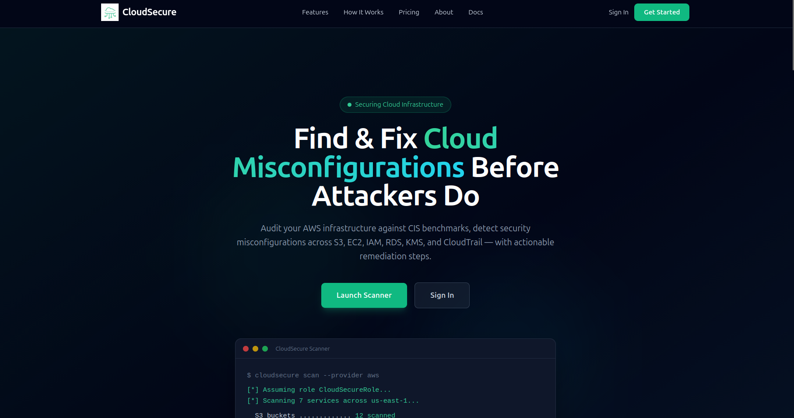
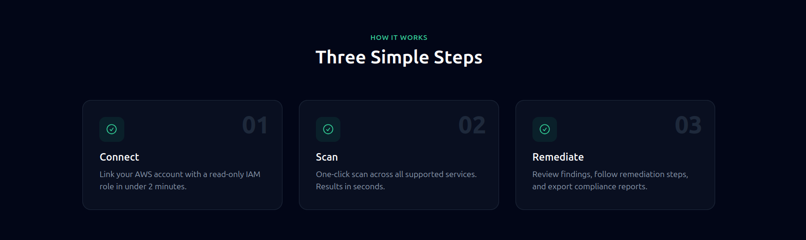
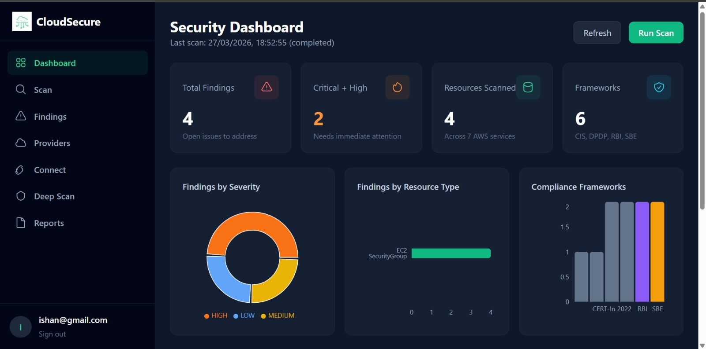
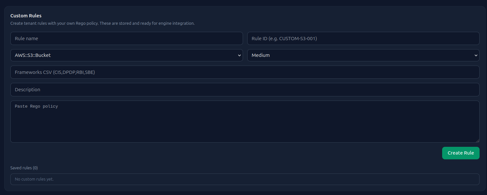
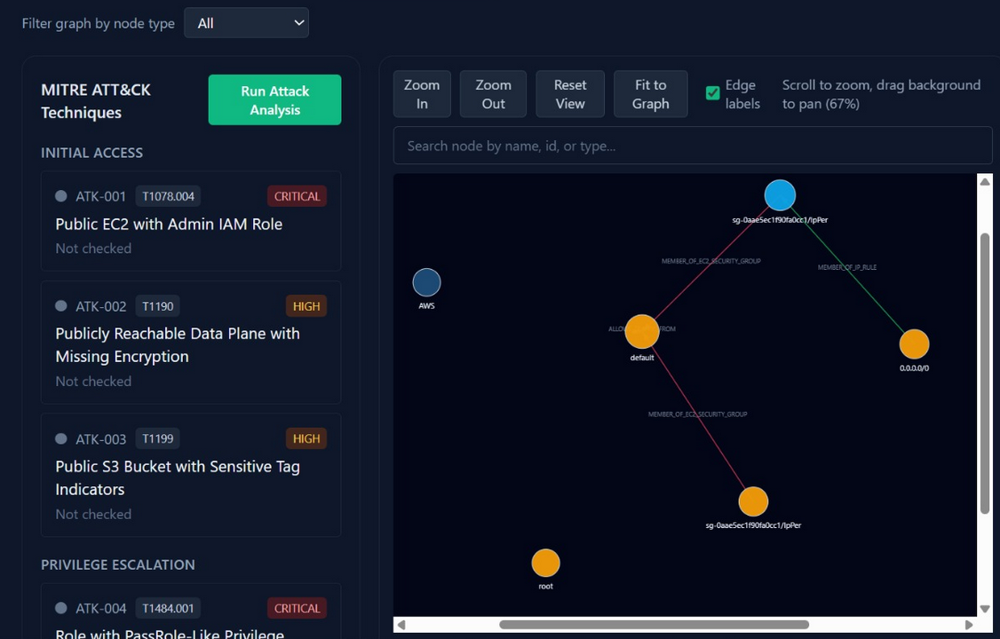
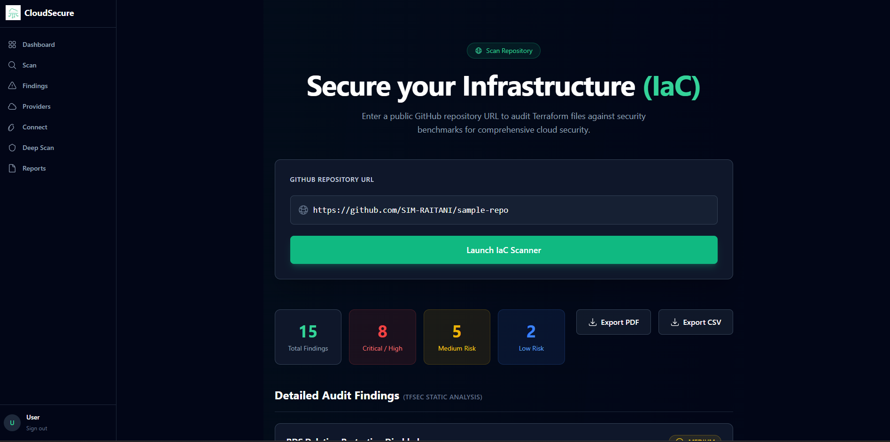
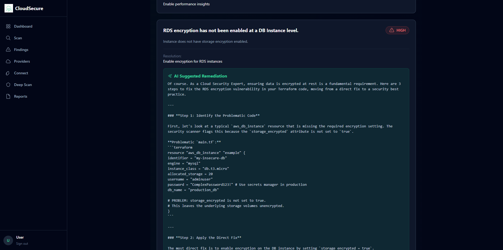

<h1 align="center">
  
  <br>
  CloudSecure
  <br>
  
</h1>

<h4 align="center">Open-source Cloud Security Posture Management (CSPM) for AWS</h4>

<p align="center">
  
  
  
  
  
  
</p>


---

> **CloudSecure** is an open-source Cloud Security Posture Management (CSPM) platform that continuously scans your AWS environment, detects misconfigurations, maps attack paths, and produces actionable compliance findings — all from a single self-hosted dashboard.


<p align="center">
  
</p>

---


## ✨ Features

| Feature | Description |
|---|---|
| **One-click AWS Scan** | Scans S3, EC2, IAM, RDS, KMS, and CloudTrail via Resource Explorer + boto3 |
| **350+ Security Checks** | CIS Benchmark and India-specific (DPDP, RBI, SBE) rules powered by OPA/Rego |
| **Consolidated S3 Rules** | Single contextual S3 public-exposure rule with optional live HTTP probes |
| **Attack Path Analysis** | Neo4j graph engine maps lateral movement and privilege escalation paths |
| **Deep Scan / Graph View** | Cartography-powered full AWS topology ingestion and interactive graph UI |
| **Graph Intelligence** | GDS analytics (PageRank, betweenness, Louvain) escalate severity and surface shadow risks |
| **Anomaly Detection** | CloudTrail embedding pipeline flags unusual principal behaviour with visual drill-down |
| **Rule Effectiveness** | Funnel metrics show how rules reduce noise from raw misconfigs to actionable findings |
| **Compliance Reporting** | Exportable reports mapped to CIS, DPDP, RBI, and SBE frameworks |
| **Multi-tenant** | Isolated workspaces per team or customer |
| **Real-time Findings** | Findings stream in as resources are scanned |
| **Suppression Workflow** | Mark findings as suppressed to track accepted risk |
| **Delta Scanning** | Incremental scans re-fetch only changed resources |
| **Custom Rego Rules** | Tenant-scoped policies evaluated alongside built-in rules |
| **IaC Scanning** | Scan Terraform in GitHub repos or locally via CLI |
| **AI Remediation** | Sarvam AI generates remediation guidance for high-severity issues |

### Platform modules (dashboard)

| Tab | What it does |
|---|---|
| **Dashboard** | Severity, framework, and resource-type breakdowns across open findings |
| **Scan** | Trigger inventory pulls and monitor run progress |
| **Findings** | Browse, filter, suppress, and export misconfiguration results |
| **Deep Scan** | Launch Cartography ingestion and explore the resource graph |
| **Graph Intel** | View graph-adjusted severity, escalation reasons, and shadow-risk nodes |
| **Rule Effectiveness** | Compare rule hit rates and noise-reduction funnel per provider |
| **Anomaly** | Run CloudTrail anomaly jobs, view embeddings, metrics, and entity findings |
| **Connect / Providers** | Link AWS accounts via STS assume-role and test connectivity |
| **Reports** | Generate compliance-oriented exports |
| **Docs** | In-app setup reference for env vars and troubleshooting |


---

## ☁️ Supported AWS Services

| Service | Checks | Standards |
|---|---|---|
| **Amazon S3** | Public access, encryption, versioning, logging, bucket policy | CIS, DPDP, RBI |
| **Amazon EC2** | Security groups, open ports, IMDSv2, public IPs | CIS, SBE |
| **AWS IAM** | MFA, inline policies, role trust policies, access keys | CIS, DPDP |
| **Amazon RDS** | Public access, encryption, backup retention, deletion protection | CIS, RBI |
| **AWS KMS** | Key rotation, key policy, multi-region keys | CIS, DPDP |
| **AWS CloudTrail** | Logging enabled, log validation, CloudWatch integration | CIS, SBE |

---

## 📋 Compliance Frameworks

CloudSecure maps every finding to one or more compliance frameworks:

- **CIS AWS Foundations Benchmark** — Industry-standard hardening guidelines
- **DPDP (Digital Personal Data Protection)** — India's 2023 data protection law
- **RBI Cyber Security Framework** — Reserve Bank of India guidelines for BFSI
- **SBE (SEBI Basic Cyber Hygiene)** — Securities and Exchange Board of India baseline

---

## 🔄 How It Works

<p align="center">
  
</p>

1. **Connect** — Link your AWS account with a read-only IAM role in under 2 minutes
2. **Scan** — One-click scan across all supported services. Results in seconds
3. **Remediate** — Review findings, follow remediation steps, and export compliance reports

---

## 🖼️ Screenshots

### Security Dashboard
<p align="center">
  
</p>


The dashboard gives you an at-a-glance view of your security posture:
- **Total Findings** — open issues to address
- **Critical + High** — findings needing immediate attention
- **Resources Scanned** — count across all AWS services
- **Frameworks** — active compliance mappings (CIS, DPDP, RBI, SBE)
- Breakdowns by severity, resource type, and compliance framework

### Add Custom Rules
<p align="center">
  
</p>

### Attack Path Analysis
<p align="center">
  
</p>

### IaC Scanning
<p align="center">
  
</p>

### AI Remediation Guide
<p align="center">
  
</p>

 

---

## 🏗️ Architecture

```
┌─────────────────────────────────────────────────────────────┐
│                        Browser                              │
│                React + Vite (port 3000)                     │
└──────────────────────────┬──────────────────────────────────┘
                           │ REST API (Token auth)
┌──────────────────────────▼──────────────────────────────────┐
│              FastAPI backend (backend-fastapi/)               │
│   Auth · Providers · Findings · Graph · Anomaly · Deep Scan │
└──────┬────────────┬─────────────────┬───────────┬───────────┘
       │            │                 │           │
┌──────▼───┐  ┌─────▼──────┐   ┌──────▼──────┐  ┌─▼───────────┐
│PostgreSQL│  │   Valkey   │   │ Neo4j Aura  │  │  Sarvam AI  │
│  (state) │  │  (broker)  │   │   (graph)   │  │(Remediation)│
└──────────┘  └─────┬──────┘   └─────────────┘  └─────────────┘
                    │
          ┌─────────▼─────────┐           ┌───────────────────┐
          │  Celery Workers   │           │   IaC Scanner     │
          │ inventory · rules │           │ (tfsec / checkov) │
          │ anomaly · deep_scan          │                   │
          └─────────┬─────────┘           └─────────▲─────────┘
                    │                               │
          ┌─────────▼──────────┐          ┌─────────┴─────────┐
          │  OPA + Rego rules  │          │  GitHub Repos     │
          │  AWS (boto3 + STS) │          │  (cloned temp)    │
          └────────────────────┘          └───────────────────┘
```

| Component | Technology | Role |
|---|---|---|
| Frontend | React 18 + Vite + Tailwind | Dashboard UI |
| API | **FastAPI 2** + SQLAlchemy + Pydantic | REST API, auth, tenant logic |
| Task Queue | Celery + Valkey | Async inventory, rules, anomaly, deep scan |
| Database | PostgreSQL 15 | Findings, runs, users, tenants |
| Graph DB | **Neo4j AuraDB** (or local Neo4j profile) | Resource graph, attack paths, GDS analytics |
| Policy Engine | OPA + Rego | Security rule evaluation |
| AWS Integration | boto3 + STS AssumeRole | Read-only resource discovery |
| Deep Scan | Cartography (AWS-only image) | Full relationship ingestion into Neo4j |

> Legacy `backend/` (Django) remains in the repo for reference; **Docker Compose runs `backend-fastapi/`** as the API and worker image.

---

## 🚀 Getting Started

### Prerequisites

- [Docker Desktop](https://www.docker.com/products/docker-desktop/) installed and running
- [AWS CLI](https://aws.amazon.com/cli/) configured with valid credentials (`aws configure`)
- An AWS account where you can create IAM roles

---

### 1. Clone the Repository

```bash
git clone https://github.com/janithashri/cloudsecure-kalitopi.git
cd cloudsecure-kalitopi
```

---

### 2. Configure Environment

```bash
cp .env.example .env
```

> See [docs/AURADB.md](docs/AURADB.md) for Neo4j AuraDB setup (recommended). Local Neo4j is optional.

Edit `.env` with your values:

| Variable | Description | Example |
|---|---|---|
| `SECRET_KEY` | App signing key | `python -c "import secrets; print(secrets.token_urlsafe(50))"` |
| `POSTGRES_DB` | PostgreSQL database name | `cloudsecure` |
| `POSTGRES_USER` | PostgreSQL username | `cloudsecure` |
| `POSTGRES_PASSWORD` | PostgreSQL password | _(set in .env only)_ |
| `POSTGRES_HOST` | PostgreSQL host (Docker service name) | `db` |
| `POSTGRES_PORT` | PostgreSQL port | `5432` |
| `VALKEY_URL` | Valkey/Redis broker URL | `redis://valkey:6379/0` |
| `NEO4J_URI` | Neo4j AuraDB URI (TLS) | `neo4j+s://YOUR_INSTANCE.databases.neo4j.io` |
| `NEO4J_USER` | Neo4j username | `neo4j` |
| `NEO4J_PASSWORD` | Neo4j AuraDB password | _(from Aura console)_ |
| `NEO4J_SHARED_DATABASE` | Aura database name | `neo4j` |
| `AWS_DEFAULT_REGION` | Resource Explorer aggregator region | `us-east-1` |
| `AWS_ACCESS_KEY_ID` | Leave blank — uses `~/.aws` credentials | _(blank)_ |
| `AWS_SECRET_ACCESS_KEY` | Leave blank — uses `~/.aws` credentials | _(blank)_ |
| `DEBUG` | Enable dev CORS / debug helpers | `True` |

---

### 3. AWS Setup (One-time)

CloudSecure uses an IAM role with read-only permissions. Run these commands once:

```bash
# Get your AWS Account ID
aws sts get-caller-identity --query Account --output text

# Enable Resource Explorer (required for resource discovery)
aws resource-explorer-2 create-index --type AGGREGATOR --region us-east-1

# Verify the index is ACTIVE (may take several minutes to over an hour)
aws resource-explorer-2 get-index --region us-east-1

# Create the CloudSecure IAM role
aws iam create-role \
  --role-name CloudSecureRole \
  --assume-role-policy-document file://trust-policy.json

# Attach read-only permissions
aws iam put-role-policy \
  --role-name CloudSecureRole \
  --policy-name CloudSecurePermissions \
  --policy-document file://permissions-policy.json
```

> `trust-policy.json` and `permissions-policy.json` are included in this repository.

---

### 4. IaC Backend Setup 

```bash
cd IaC_backend
cp .env.example .env
pip install -r requirements.txt  #Download the required packages
python run.py   #To run the development server
```

---

### 5. Build & Start

```bash
docker compose build
docker compose up -d
```

Optional workers:

```bash
# Deep scan (Cartography) — heavy image
docker compose --profile deep-scan up -d celery-deep-scan

# Local Neo4j instead of AuraDB
docker compose --profile local-neo4j up -d neo4j
```

First-time anomaly tables (if using the Anomaly tab):

```bash
docker compose exec backend python scripts/init_anomaly_tables.py
```

Create your account via **Register** at http://localhost:3000/login (or `POST /api/auth/register/`).

---

### 6. Open the App

| Service | URL |
|---|---|
| **Dashboard** | http://localhost:3000 |
| **API** | http://localhost:8000 |
| **IaC Backend** | http://localhost:5000 |
| **Neo4j Aura** | https://console.neo4j.io (or local Browser at http://localhost:7474 with `--profile local-neo4j`) |

1. Register / log in at http://localhost:3000/login
2. Go to **Connect** → enter your AWS Account ID and role name `CloudSecureRole`
3. Click **Test Connection** — a green check confirms the role works
4. Go to **Scan** → click **Run Scan**
5. Findings appear under **Findings**; use **Graph Intel**, **Deep Scan**, and **Anomaly** for advanced analysis

---

## 🛠️ Useful Commands

| Command | Description |
|---|---|
| `docker compose up -d` | Start core services |
| `docker compose down` | Stop services |
| `docker compose build` | Build images |
| `docker compose logs -f backend celery` | Tail API + worker logs |
| `docker compose --profile deep-scan up -d celery-deep-scan` | Start deep-scan worker |
| `docker compose restart backend celery` | Reload after `.env` changes |
| `.\scripts\start-local.ps1` | Windows helper: start stack in two steps |
| `.\scripts\prepare-public-push.ps1` | Scan for secrets before pushing to a public repo |

> `make migrate` / `make createsuperuser` target the legacy Django `backend/` folder. The FastAPI stack uses `/api/auth/register/` for new users.

---

## 🔑 Required IAM Permissions

CloudSecure's IAM role requires the following read-only permissions:

```json
{
  "Version": "2012-10-17",
  "Statement": [
    {
      "Effect": "Allow",
      "Action": [
        "resource-explorer-2:Search",
        "resource-explorer-2:GetIndex",
        "resource-explorer-2:GetDefaultView",
        "resource-explorer-2:ListViews",
        "s3:GetBucketPolicy",
        "s3:GetBucketAcl",
        "s3:GetBucketEncryption",
        "s3:GetBucketVersioning",
        "s3:GetBucketLogging",
        "s3:GetPublicAccessBlock",
        "ec2:DescribeInstances",
        "ec2:DescribeSecurityGroups",
        "iam:GetRole",
        "iam:GetUser",
        "iam:ListRolePolicies",
        "iam:GetRolePolicy",
        "iam:ListUserPolicies",
        "iam:GetUserPolicy",
        "iam:ListMFADevices",
        "rds:DescribeDBInstances",
        "kms:DescribeKey",
        "kms:GetKeyPolicy",
        "kms:GetKeyRotationStatus",
        "cloudtrail:DescribeTrails",
        "cloudtrail:GetTrailStatus",
        "cloudtrail:GetEventSelectors",
        "sts:GetCallerIdentity"
      ],
      "Resource": "*"
    }
  ]
}
```

---

# 🛡️ CloudSecure CLI

CloudSecure is a comprehensive security posture management tool built by **Team Kaali Topi**. It audits Infrastructure as Code (Terraform) to find misconfigurations .

---

## 🚀 cloudSecure-kaalitopi CLI (Python Scanner)

The `cloudsecure-kaalitopi` package is our official CLI tool, allowing you to run security audits directly from your terminal.

---

## Installation Guide 

```bash
pip install cloudsecure-kaalitopi  #This will install the package locally on your system and you can scan the files locally
```

---

## 🛠️ Useful Commands

| Command | Description |
|---|---|
| `cloudsecure-kaalitopi --version` | To know the current verion of the CLI tool. |
| `cloudsecure-kaalitopi iac test.tf` | To scan the file locally , present in the current working directory. |
| `cloudsecure-kaalitopi iac test.tf --csv-export` | To scan as well as save the CSV report locally. |
| `cloudsecure-kaalitopi iac test.tf --pdf-export` | To scan as well as save the PDF report locally. |
| `cloudsecure-kaalitopi --help` | To get more information about the CLI tool. |

---

## 🐛 Troubleshooting

**`NoCredentialError` on connection test**  
The backend mounts `~/.aws` from your host. Run `aws configure`, or set `AWS_ACCESS_KEY_ID` / `AWS_SECRET_ACCESS_KEY` in `.env`.

**`Resource Explorer index not found`**  
Create the aggregator index in `us-east-1` and wait until `State` is `ACTIVE`:

```bash
aws resource-explorer-2 create-index --type AGGREGATOR --region us-east-1
aws resource-explorer-2 get-index --region us-east-1
```

**`Password authentication failed` for PostgreSQL**  
The Postgres volume was initialized with a different password:

```bash
docker compose down -v
docker compose up -d
```

**Neo4j / Graph Intel / Deep Scan errors**  
Set Aura credentials in `.env` (`neo4j+s://...`). See [docs/AURADB.md](docs/AURADB.md). GDS analytics require Aura Professional or local Neo4j (`docker compose --profile local-neo4j up -d neo4j`).

**Findings not appearing after scan**  
1. Ensure OPA is running: `docker compose ps opa`  
2. Check Celery logs: `docker compose logs -f celery`  
3. Confirm `OPA_URL: http://opa:8181` in `docker-compose.yml` for `backend` and `celery`

**Celery not picking up tasks**  
Restart workers: `docker compose restart celery`. Deep-scan tasks use the `deep_scan` queue — start `celery-deep-scan` with `--profile deep-scan`.

**Frontend blank page or CORS errors**  
Rebuild: `docker compose up -d --build frontend`. In dev, Vite proxies `/api` to the backend — leave `VITE_API_URL` unset.

**Graph Intelligence shows `gds_available: false`**  
GDS is not available on AuraDB Free. Upgrade to Aura Professional or use the local Neo4j profile.

---

## 🤝 Contributing

Contributions are welcome! Please open an issue first to discuss what you'd like to change.

1. Fork the repository
2. Create a feature branch (`git checkout -b feature/amazing-feature`)
3. Commit your changes (`git commit -m 'Add amazing feature'`)
4. Push to the branch (`git push origin feature/amazing-feature`)
5. Open a Pull Request

---

## 📄 License

This project is licensed under the MIT License — see the [LICENSE](LICENSE) file for details.

---

<p align="center">
  Built by <strong>Team Kaalitopi</strong> · Cloud Security Scanner
</p>